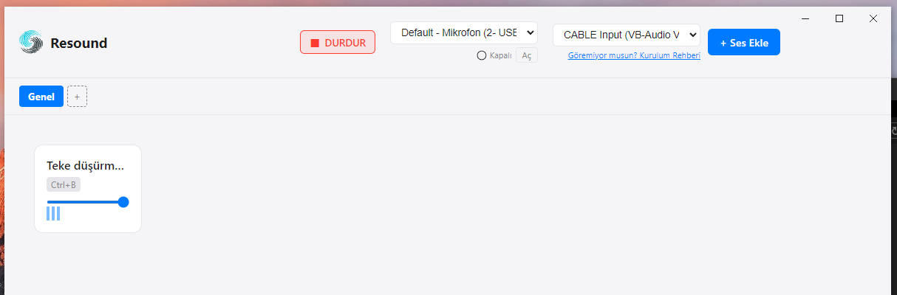

# Resound

**Resound**, modern, hizli ve sik bir masaustu **Soundboard** uygulamasidir. Mikrofonunuzu ve ses efektlerinizi tek bir sanal kanaldan (Virtual Cable) gecirerek oyunlarda veya Discord'da yuksek kaliteli ses deneyimi sunar.



## Ozellikler

*   **Mikrofon Mixing (Passthrough):** Kendi sesinizi ve soundboard seslerini tek bir cikista birlestirir. Ekstra programlara (VoiceMeeter vb.) gerek kalmaz.
*   **Panik Butonu (DURDUR):** Acil durumlarda "DURDUR" butonuyla tum calan sesleri aninda susturun.
*   **Ses Kontrolu:** Her ses karti icin ayri ses seviyesi ayari. Uygulama ayarlari hatirlar.
*   **Kategoriler:** Seslerinizi "Oyun", "Muzik", "Meme" gibi sekmelere ayirarak duzenleyin.
*   **Ozel Kisayollar:** Her ses icin klavye kisayolu atayin. Uygulama arkada calisirken bile tuslara basarak ses calin.
*   **Modern Arayuz:** Goz yormayan, premium hissettiren "Neon/Light" hibrit tasarim.
*   **Performansli:** Electron ve React ile gelistirildi, sistem kaynaklarini minimum kullanir.

## Kurulum

1.  **Indir:** [Releases](https://github.com/system-conf/resound/releases) sayfasindan son surumu (`Resound-Portable.zip`) indirin.
2.  **Cikart:** ZIP dosyasini bir klasore cikartin.
3.  **Calistir:** `Resound.exe`'yi acin.

### Ilk Ayarlar
1.  **Sanal Kablo:** Eger yuklu degilse, uygulamadaki "Kurulum Rehberi" ile VB-Cable surucusunu kurun.
2.  **Ses Cikisi:** Uygulamada sag ustten `CABLE Input (VB-Audio Virtual Cable)` secin.
3.  **Mikrofon:** Sol ustten kendi mikrofonunuzu secin ve "Ac" butonuna basin.
4.  **Hedef Uygulama:** Discord veya Oyun ses ayarlarinda Giris Cihazi (Input) olarak `CABLE Output` secin.

## Gelistirme (Development)

Projeyi kendi bilgisayarinizda gelistirmek icin:

```bash
# Depoyu klonlayin
git clone https://github.com/system-conf/resound.git

# Klasore girin
cd resound

# Bagimliliklari yukleyin
npm install

# Gelistirme modunda calistirin
npm run dev
```

### Derleme (Build)

Windows icin tasinabilir surum olusturmak icin:

```bash
npm run build
```
*Ciktilar `release/win-unpacked` klasorunde olusacaktir.*

## Lisans

Bu proje [MIT](LICENSE) lisansi ile lisanslanmistir.
